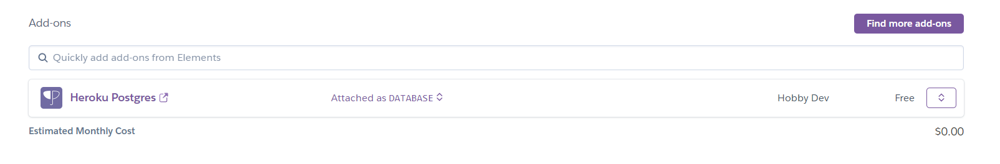

1. Pull main repo
2. create virtual environment 
3. install requirements.txt
4. run it

Project was made with Python/Django, Heroku, Postgresql

heroku https://ilim-backend.herokuapp.com/
admin page https://ilim-backend.herokuapp.com/admin

admin login: admin
admin password: admin

